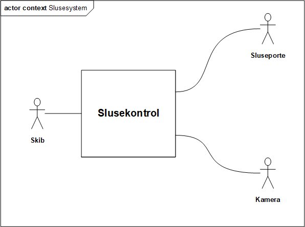

---
title: "Slusekontrolsystem"
author: [Adam Ryager Høj (201803767), Rasmus Kahr (201803491), Sigurd Skov Jensen (201804402)]
date: "2020-02-17"
keywords: [UCD, MoSCoW, FURPS]
...

# I2ISE

<!-- 
 -->

**Besvarelse af obligatorisk opgave**

**Opgave A**

\[Specifikation af slusesystem\]

**Afleveret:** \[17-02-2020\]

**Afleveret af**:  Gruppe 37

**Deltagere i afleveringen**

  |Studienummer  | Navn                 |Studieretning |
  |--------------| -------------------- |---------------|
  |201804402     | Sigurd Skov Jensen   |I|
  |201803491     | Rasmus Kahr          |E|
  |201803767     | Adam Ryager Høj      |E|

**Kontaktperson**

  |Studienummer   |Navn   |E-mail  | Studieretning  |
  |-------------- |------ |--------| ---------------|
                  

**Review af:** \[Indsæt gruppenummer, evt. ingen\]

- [I2ISE](#i2ise)
  - [Use case diagrammer](#use-case-diagrammer)
    - [Beskrivelse af aktører](#beskrivelse-af-aktører)
  - [Fully Dressed use case](#fully-dressed-use-case)
  - [FURPS+ // MoSCoW](#furps--moscow)

## Use case diagrammer

### Beskrivelse af aktører

| Aktør     | Type     | Beskrivelse                                                                                                   |
| --------- | -------- | ------------------------------------------------------------------------------------------------------------- |
| Skib      | Prim.   | Skibet bruger systemet. Skibet sejler frem til slusesystemet for at passere fra høj til lav eller vice versa. |
| Kaptajn   | Prim.   | Kaptajnen sejler skibet og bruger dermed slusesystemet for at komme frem til sin destination.                 |
| Kamera    | Sek. | Kamera registrerer indkomne skibe på høj og lav side. Kamera holder øje med vandstanden i slusekammeret.      |
| Sluseport | Sek. | Sluseportene åbner og lukker efter systemets behov for at skibe kan passere.                                  |

## Fully Dressed use case

+---------------------------------+-----------------------------------+
| **Navn**                        | **Passerer fra lav side**         |
+=================================+===================================+
| **Mål**                         | Lade et skib anvende              |
|                                 | slusesystemet til at bevæge sig   |
|                                 | fra den lave side af              |
|                                 | slusesystemet til den høje side   |
+---------------------------------+-----------------------------------+
| **Initiering**                  | Et skib holder indenfor           |
|                                 | kamerafeltet "kamera lav"         |
+---------------------------------+-----------------------------------+
| **Aktører**                     | Skibet, men faktisk kaptajnen     |
+---------------------------------+-----------------------------------+
| **Antal samtidige forekomster** | 1 (Der er kun én mulig forekomst  |
|                                 | af gangen)                        |
+---------------------------------+-----------------------------------+
| **Prækonditioner**              | Slusen er operationel, ikke i     |
|                                 | brug, og der er vand til skibene  |
+---------------------------------+-----------------------------------+
| **Postkonditioner**             | Skibet befinder sig på den høje   |
|                                 | side og har passeret kamerafeltet |
|                                 | "kamera høj"                      |
+---------------------------------+-----------------------------------+
| **Hovedscenarie**               | 1.  Et skib holder indenfor       |
|                                 |     kamerafeltet "kamera lav"     |
|                                 |                                   |
|                                 | 2.  Slusen begynder at dræne\     |
|                                 |     * **EXT1**: Et skib holder   |
|                                 |     indenfor kamerafeltet "kamera |
|                                 |     høj"*                         |
|                                 |                                   |
|                                 | 3.  Indtil den når lav vandstand, |
|                                 |     som detekteret af "kamera     |
|                                 |     midt"                         |
|                                 |                                   |
|                                 | 4.  Sluseport lav åbner           |
|                                 |                                   |
|                                 | 5.  Skibet sejler ind i           |
|                                 |     sluseelevatoren               |
|                                 |                                   |
|                                 | 6.  Når den forlader kamerafelt   |
|                                 |     "kamera lav" og bevæger sig   |
|                                 |     ind i kamerafelt "kamera      |
|                                 |     midt"                         |
|                                 |                                   |
|                                 | 7.  Sluseport lav lukker          |
|                                 |                                   |
|                                 | 8.  Sluseelevatoren fyldes med    |
|                                 |     vand                          |
|                                 |                                   |
|                                 | 9.  Indtil den når vandstand høj, |
|                                 |     som detekteret af "kamera     |
|                                 |     midt"                         |
|                                 |                                   |
|                                 | 10. Sluseport høj åbner           |
|                                 |                                   |
|                                 | 11. Skibet sejler ud af           |
|                                 |     kamerafelt "kamera midt", ind |
|                                 |     i kamerafelt "kamera høj"     |
|                                 |                                   |
|                                 | 12. Skibet forlader kamerafelt    |
|                                 |     "kamera høj"                  |
|                                 |                                   |
|                                 | 13. Sluseport høj lukker.\        |
|                                 |     * **EXT2**: Der er et andet  |
|                                 |     skib i kamerafelt "kamera     |
|                                 |     høj"*                         |
|                                 |                                   |
|                                 | 14. Sluseelevator drænes indtil   |
|                                 |     den når et midtpunkt, som     |
|                                 |     detekteret af "kamera midt",  |
|                                 |     og afventer det næste input   |
|                                 |     fra kamerafelterne.           |
+---------------------------------+-----------------------------------+
|                                 | **EXT1:** Skibet prioriterer      |
|                                 | skibe fra høj side først.         |
|                                 |                                   |
|                                 | 1.  Vent til **passerer høj       |
|                                 |     side** er afsluttet.          |
|                                 |                                   |
|                                 | 2.  Forsæt use case.              |
|                                 |                                   |
|                                 | **EXT2:** Skibet prioriterer at   |
|                                 | et skib er ved nuværende          |
|                                 | vandhøjde.                        |
|                                 |                                   |
|                                 | 1.  Afslut use case.              |
|                                 |                                   |
|                                 | 2.  Forsæt use case **passerer    |
|                                 |     høj side.**                   |
+---------------------------------+-----------------------------------+

## FURPS+ // MoSCoW

Herunder er forsøgt at få de *ikke-funktionelle krav* prioriteret efter MoSCoW modellen.

- Skal
  - Kun ét skib ad gangen **skal kunne** passere.
  - Ét skib ind **skal** ind, ét skib **skal** ud.
  - Systemet **skal** kunne startes op på 72 timer.
  - Et skib **skal** kunne passerer på 90 minutter.

- Bør
  - Et skib **bør** kunne passerer slusesystmet på **30** minutter.
  - Der **bør** være en indikation om hvorvidt portkammeret er ledigt.
  - Ved nedtid **bør** systemet kunne startes igen på 24 timer.
  - Nedetid **bør** være < 5% ved 2mnd. brug baseret på flg. reliability udregning;
    - $24\text{h} \cdot 2\text{m} = 1440\text{h}$.
    - $\frac{72\text{h}}{1440\text{h}}=5\%$
  - Portkammeret **bør** drænes på 2 timer - muligøre service / rengøring.
 
- Kunne  
  - Kameraene **kunne** serviceres hvert 3. år for bedste effekt.
  - Der **kunne** være mulighed for, at se om der skibe på den modstatte side.
  - Kaptajn el. lign **kunne** signalere nødstop.

